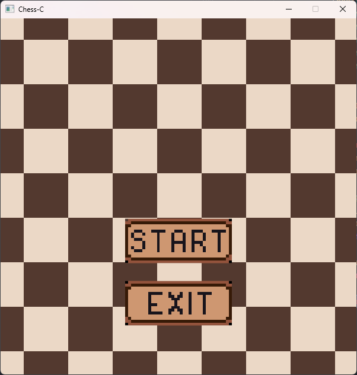
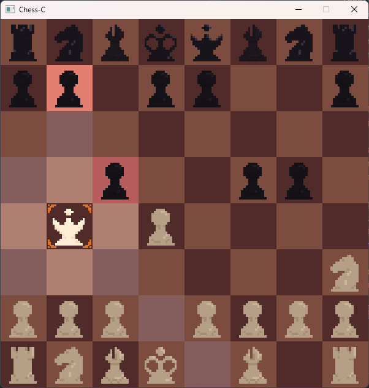

# Chess
Простые шахматы на написанные на C.

## Меню

## Игра

## Использованные библотеки

- [Sokol](https://github.com/floooh/sokol) Для рендеринга
- [Stb](https://github.com/nothings/stb) Для загрузки изображений
- [GLFW](https://github.com/glfw/glfw) Для окна приложения